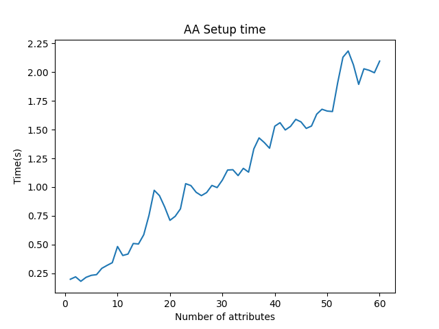
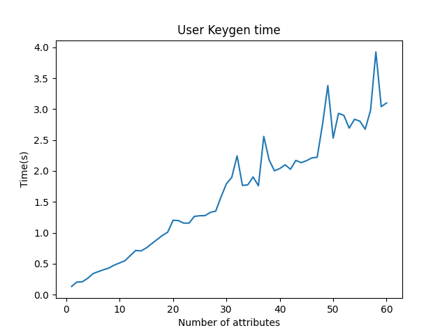
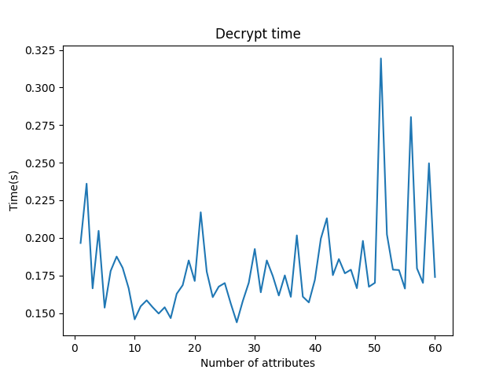

# Cách sử dụng các lược đồ MA-CP-ABE
## Bước 1: Cài đặt Python, C/C++ compiler và các thư viện cần thiết
Sử dụng môi trường linux như ubuntu hoặc wsl trên windows để cài đặt các thư viện cần thiết một cách dễ nhất.

Cài đặt Python phiên bản 3.6 trở lên

`flex, bison, libssl-dev, python-dev, libgmp-dev`

`stanford pbc library` [link](https://crypto.stanford.edu/pbc/)

`charm-crypto library v0.50` trên github [link](https://jhuisi.github.io/charm/)
## Bước 2: Chạy file gui.py
Chạy lệnh `python3 gui.py` để mở giao diện chương trình mô phỏng hệ thống.
## Bước 3: Chọn lược đồ
Chọn 1 trong những lược đồ có sẵn và nhấn CASetup. Hệ thống sinh ra các global public parameters - các tham số toàn cục cần thiết cho hệ mật mã đa thuộc tính.

GPP được dùng trong tất cả các bước tiếp theo, nên cần chú ý lưu lại.

## Bước 4: AASetup
Nhập các thuộc tính của từng AA vào ô tương ứng mà nó quản lý và nhấn AASetup.
Các AA thực hiện sinh cặp khóa công khai và khóa bí mật cho mình.

Lưu ý: Không trùng thuộc tính dù trong cùng 1 AA hay 2 AA khác nhau.
Định dạng chuỗi nhập vào: "Attribute1 Attribute2 Attribute3"
## Bước 5: Mã hóa dữ liệu
Nhập dữ liệu cần mã hóa vào ô Data và chính sách truy cập vào ô Access Policy rồi nhấn Encrypt.
Bước này sử dụng các khóa công khai của các AA để mã hóa dữ liệu.

Ví dụ:
Data: "Alice" và Access Policy dạng: "((DOCTOR OR RESEARCHER) AND (PHD OR PROFESSOR))" hoặc "(DOCTOR AND PHD) OR (RESEARCHER AND PROFESSOR)". 

Lưu ý: Hai chính sách truy cập này khác ngữ nghĩa
## Bước 6: Đăng ký người dùng
Nhập id của người dùng vào ô GID và các thuộc tính của người dùng vào ô User attributes rồi nhấn Register.
Các AA thực hiện cấp các khóa bí mật tương ứng cho các thuộc tính mà nó quản lí tới người dùng đó. Bước này sử dụng các khóa bí mật của các AA. Đầu vào có cả gid của người dùng nên kể cả 2 người dùng có thuộc tính giống nhau thì cũng sẽ có các khóa bí mật khác nhau.

Lưu ý: Không trùng GID người dùng đã có, do chỉ là mô phỏng nên sẽ thay thế người dùng đã tồn tại nếu nhập GID đã tồn tại.
## Bước 7: Giải mã
Nhập id của người dùng vào ô GID rồi nhấn Decrypt. Do chỉ là mô phỏng nên sẽ không có bước nhập mật khẩu người dùng.
Bước này sử dụng các khóa bí mật của người dùng được cấp để giải mã dữ liệu.

Nếu các thuộc tính của người dùng không đủ để giải mã, sẽ hiện thông báo lỗi. Còn nếu đủ, sẽ hiện thông báo thành công và kết quả giải mã.

Ví dụ: Với chính sách truy cập ((DOCTOR OR RESEARCHER) AND (PHD OR PROFESSOR)),
nếu người dùng có ít nhất 1 cặp thuộc tính trong số (DOCTOR,PHD), (RESEARCHER,PROFESSOR), (DOCTOR,PROFESSOR) và (RESEARCHER,PHD) thì sẽ giải mã thành công.

Với chính sách truy cập ((DOCTOR AND PHD) OR (RESEARCHER AND PROFESSOR)),
nếu người dùng có ít nhất 1 cặp thuộc tính (DOCTOR,PHD) hoặc (RESEARCHER,PROFESSOR) thì sẽ giải mã thành công.

# Các kết quả đo đạc
Thời gian thực thi các bước sẽ khác nhau tùy thuộc vào số lượng thuộc tính, số lượng AA, số lượng thuộc tính của người dùng và chính sách truy cập.
Ngoài ra nó còn phụ thuộc vào loại đường cong elliptic được chọn để khởi tạo hệ thống, các tham số của từng loại nằm trong file `pairingcurves.py`. Ở đây chúng ta lựa chọn lược đồ MAABE YJ14 để đo thời gian từng bước.
Dưới đây là kết quả thời gian thực thi các bước với các tham số khác nhau:
## SS512
Các cặp loại A hay SS512 được xây dựng trên đường cong `y^2=x^3+x` trên trường `F_q` đối với một số số nguyên tố `q=3 mod 4` . Cả `G_1` và `G_2` đều là nhóm điểm E(F_q) , vì vậy sự ghép cặp này là đối xứng. Cấp r là một thừa số nguyên tố nào đó của q+1.

## SS1024
Loại A1 hay SS1024 sử dụng cùng một phương trình nhưng có các trường khác nhau. Nó hỗ trợ các trường có thứ tự tổng hợp.

